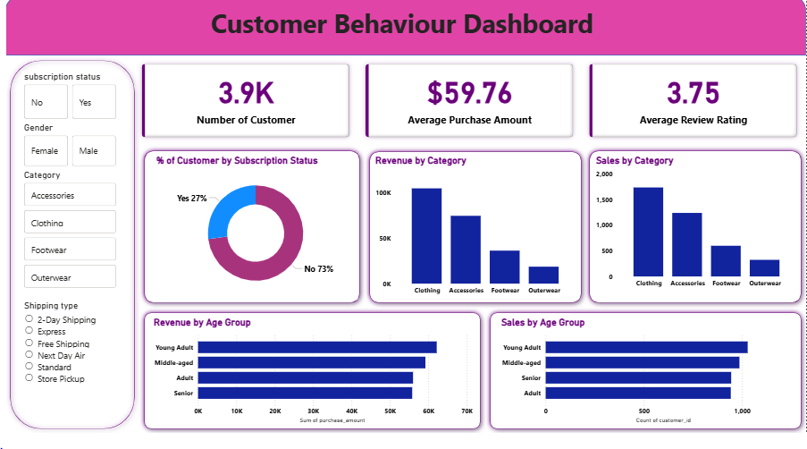

📊 Customer Behaviour Dashboard

Tools: Python | SQL | Power BI

📌 Project Overview

This project focuses on analyzing customer behavior and purchasing patterns using Python for data processing, SQL for querying and transformation, and Power BI for interactive data visualization.
The goal is to help businesses understand customers better and make data-driven decisions.

## 📊 Dashboard Preview

🗂Dataset

The dataset contains customer transaction data including:

Customer ID

Gender

Age group

Product category

Purchase amount

Review rating

Shipping type

Subscription status

This dataset helps analyze customer demographics, spending patterns, and product preferences.

🛠 Tools Used

SQL – Data exploration and analysis

Power BI – Interactive dashboard creation

CSV Dataset – Source data

SQL Analysis

📌Key SQL queries were used to analyze the dataset:

Total revenue by gender

Customers who used discounts but spent above average

Top products by review rating

Average purchase amount per customer

Revenue distribution by product category

🚀Key Insights

Clothing and accessories generate the highest revenue among product categories.

Young adult customers contribute the highest purchase value.

A majority of customers do not use subscription services.

The average purchase amount per customer is approximately $59.76.

Review ratings remain relatively consistent across product categories.

